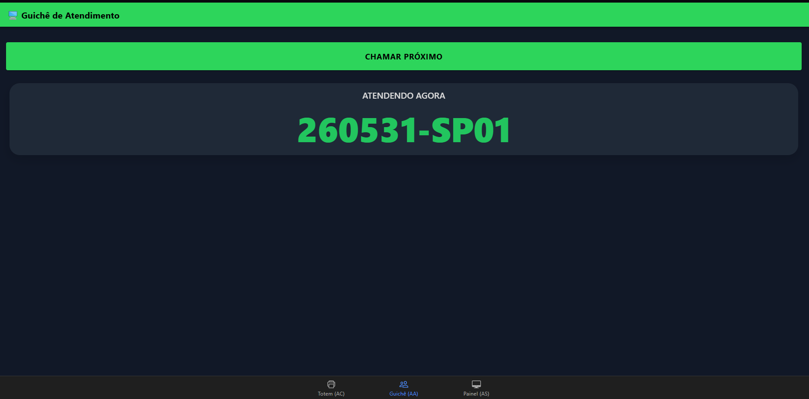
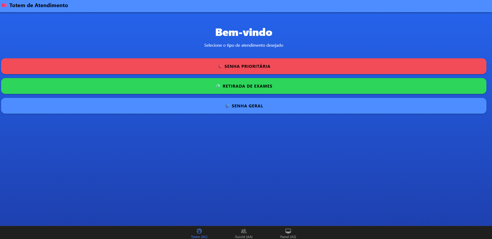
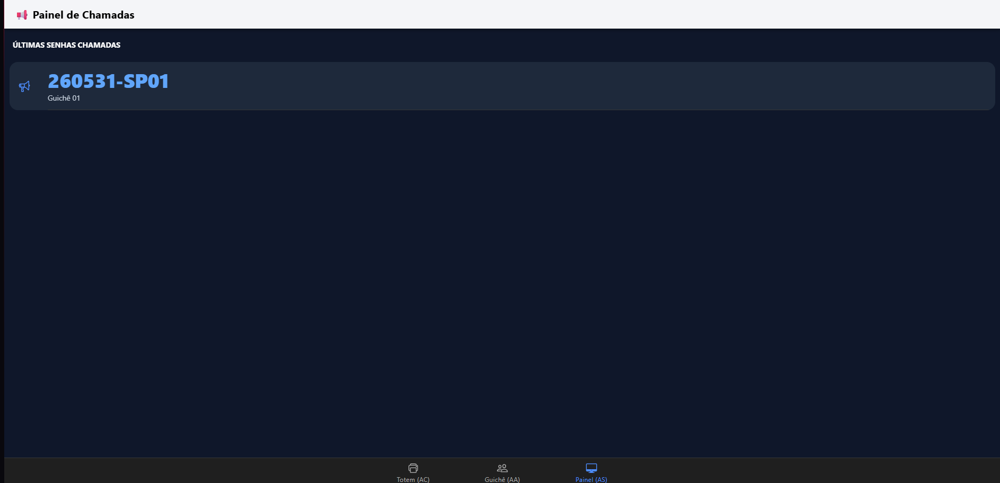

# 🎟️ MobileTicketsIonic

Aplicativo desenvolvido com **Ionic Framework** e **Angular** para simular um sistema de gerenciamento de senhas de atendimento.

O sistema permite emitir senhas, realizar chamadas para atendimento e visualizar o histórico das últimas senhas chamadas através de uma interface intuitiva e responsiva.

---

## 🚀 Tecnologias Utilizadas

* Ionic Framework
* Angular
* TypeScript
* HTML5
* SCSS
* Node.js
* npm

---

## 📋 Funcionalidades

### 🎟️ Totem de Atendimento

* Emissão de senhas prioritárias (SP)
* Emissão de senhas para retirada de exames (SE)
* Emissão de senhas gerais (SG)

### 🖥️ Guichê de Atendimento

* Chamada da próxima senha da fila
* Exibição da senha em atendimento

### 📢 Painel de Chamadas

* Exibição das últimas senhas chamadas
* Atualização em tempo real das chamadas realizadas

---

## 📸 Capturas de Tela

### Totem de Atendimento



### Guichê de Atendimento



### Painel de Chamadas



---

## 📂 Estrutura do Projeto

```text
src/
├── app/
│   ├── tab1/
│   ├── tab2/
│   ├── tab3/
│   ├── services/
│   ├── tabs/
│   ├── app.module.ts
│   └── app-routing.module.ts
├── assets/
├── theme/
└── global.scss
```
---

## 🎯 Objetivo Acadêmico

Este projeto foi desenvolvido com o objetivo de aplicar conceitos de desenvolvimento mobile utilizando o Ionic Framework e Angular, abordando:

* Componentização
* Navegação por abas (Tabs)
* Serviços Angular
* Compartilhamento de dados
* Interface responsiva
* Desenvolvimento híbrido

---

## 👨‍💻 Autor

**Cristiano Henrry**

GitHub: https://github.com/CristianoHenrry

---

## 📄 Licença

Este projeto está licenciado sob os termos da licença MIT.
